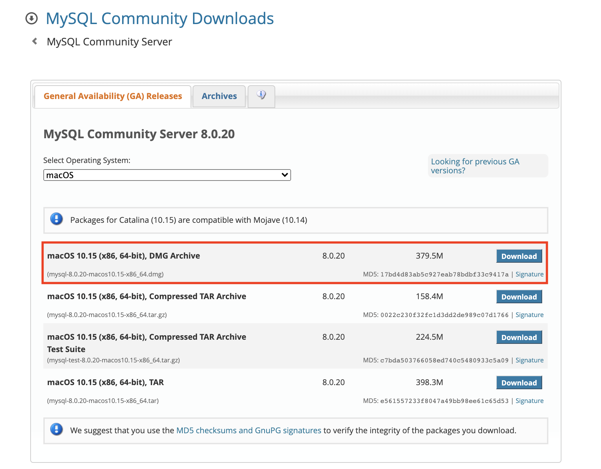
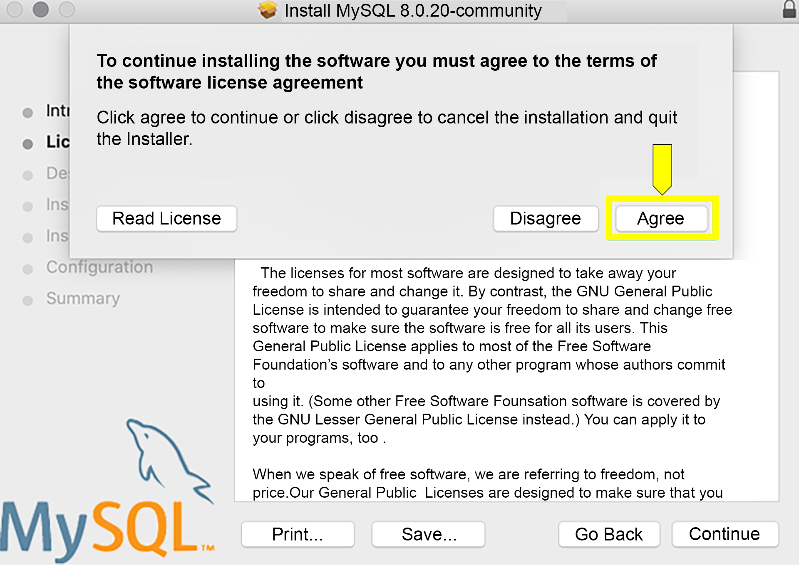
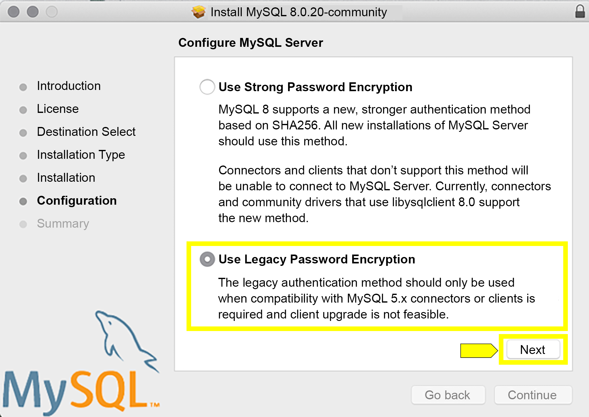
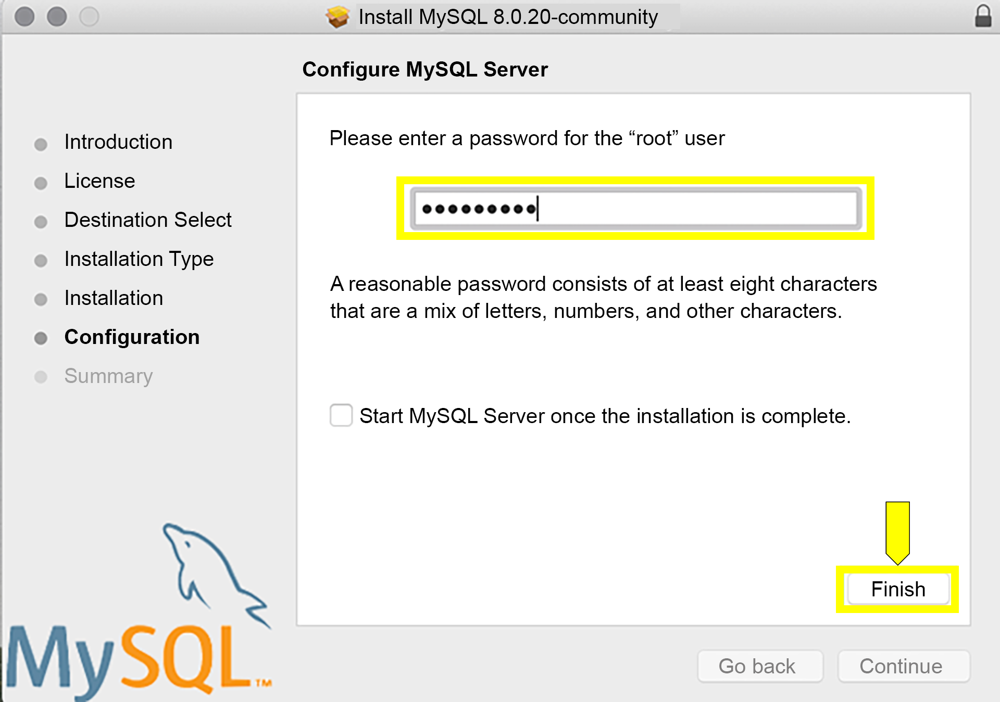
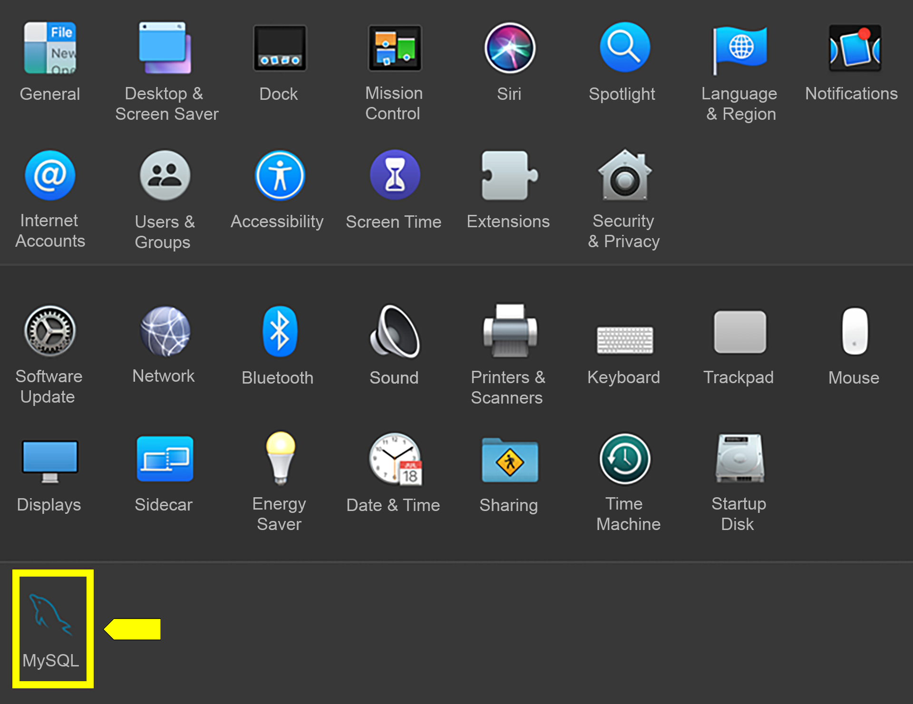
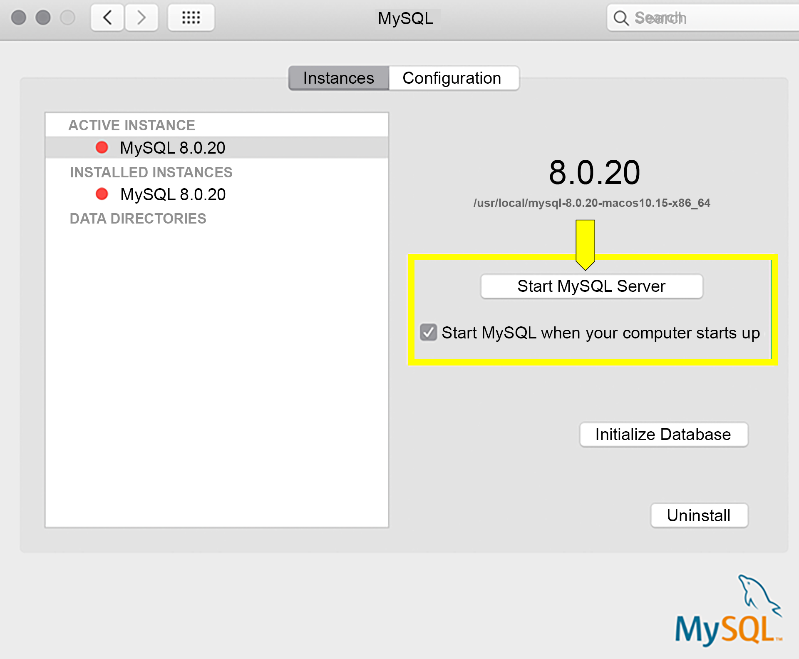
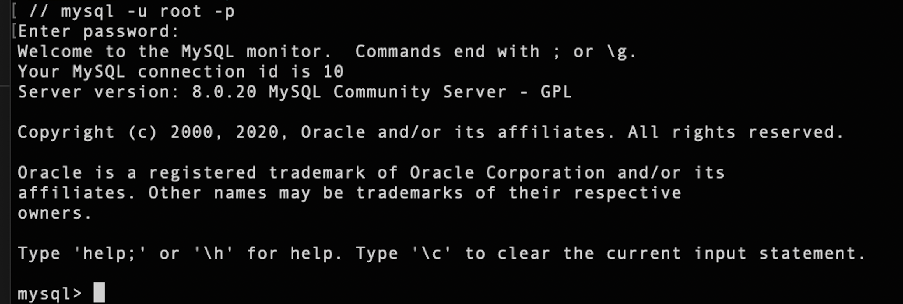
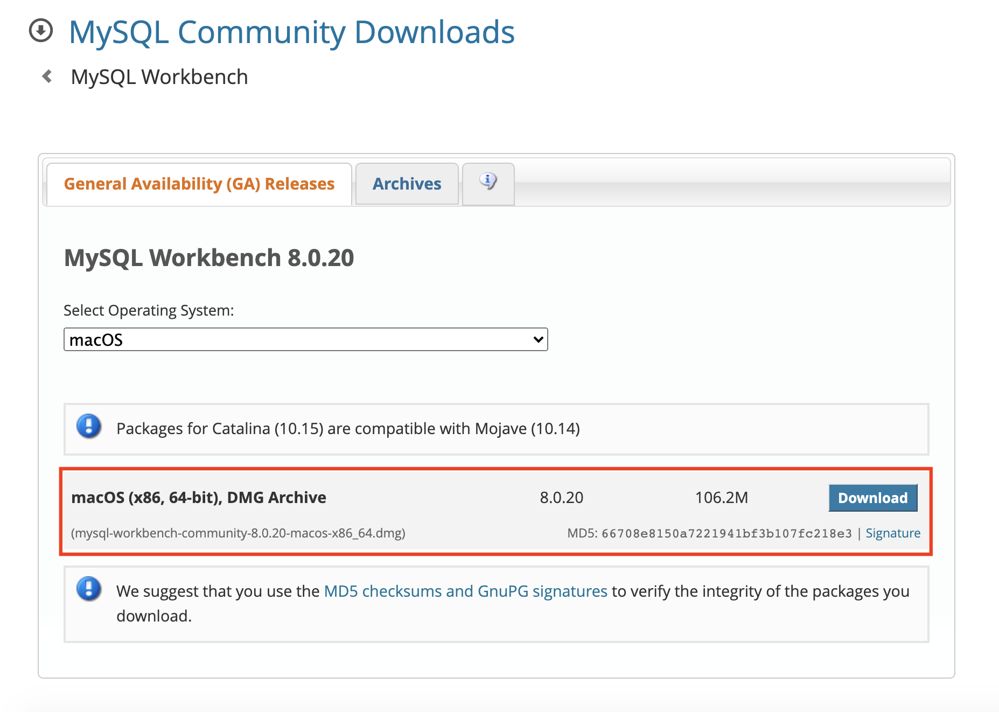

# MySQL Server Installation Guide (Mac)

* Navigate to the MySQL Community Downloads page for the [MySQL Community Server](https://dev.mysql.com/downloads/mysql).

* Select `macOS` from the Operating System dropdown menu.

* Find the `DMG Archive` version of the MySQL server installer, which should be the first one on the list.



  * It will be labeled `macOS 10.xx (x86, 64-bit), DMG Archive`, where "xx" is a combination of numbers.

* Making sure you are downloading the `.dmg` file, click the "Download" button.

* When prompted about signing up for a free Oracle Web Account, click “No thanks, just start my download.”


* After the installer has downloaded, open it to begin the installation process.

* Click “Continue” to get to the Software License Agreement Screen.

* Click “Continue” to agree with the Software License Agreement and click “Agree”.



* Click “Install” and input your password to allow the installer to continue.

* **IMPORTANT**: On the "Configure MySQL Server" screen, make sure to select “Use Legacy Password Encryption” and click “Next”.



* Create a root password. **WARNING**: Do not forget this password! It's extremely important that you keep track of your root password for MySQL, as it is difficult to reset. Make sure that you write it down somewhere you can find it or add it to a password manager. 



* After entering a password, click “Finish”.

* To check if everything was installed correctly, go to “System Preferences” and the MySQL icon should show up at the bottom.



* Click on the MySQL icon and this will bring up a GUI in which you can Start or Stop your server. You can also set it to start server when you turn on your computer.



* You may need to restart your computer to change these settings in your System Preferences.

* Once you verify that the MySQL Server was correctly installed, move onto setting up the MySQL Shell below.


# MySQL Shell

* Now that we have installed the MySQL Server, we need to make sure we can initialize the MySQL command line prompt (or MySQL Shell) in our Terminal.

* Go to "System Preferences" and click on the MySQL icon.

* Click on "Start MySQL Server"

* Open your Terminal and use the `cd` command to navigate to a directory where you'll be working; for example, one of your project folders.

* Once in the directory, enter the following command to initialize the MySQL command line prompt:

  ```bash
  mysql -u root -p
  ```

* This tells the MySQL shell that you want to log in with the root user (`-u`). The `-p` stands for "password." You will need to enter your MySQL password.



* If you see the MySQL command line prompt `mysql>`, everything is working correctly. Type `quit` to exit the MySQL command line prompt.

* **NOTE**: Some MacOS users may find that this doesn't work and get the error message, "Command not found". If that is the case, add the following line of code to your `.bash_profile` file; or, if you’re using ZSH, add it to your `.zshrc` file:
 
  ```bash
  export PATH="${PATH}:/usr/local/mysql/bin/"
  ```

* When you're done, restart your Terminal for this line to take effect.

* Try initializing the MySQL Shell again: `mysql -u root -p`

* Once you verify that the MySQL Shell can be initialized correctly, move onto installing MySQL Workbench below.


# MySQL Workbench Installation Guide

* Navigate to the MySQL Community Downloads page for the [MySQL Workbench](https://dev.mysql.com/downloads/workbench/).

* Select `macOS` from the Operating System dropdown menu.

* Find `macOS (x86, 64-bit), DMG Archive` and click “Download”.



* When prompted about signing up for a free Oracle Web Account, click “No thanks, just start my download.”

* After the installer has downloaded, open it to begin the installation process.