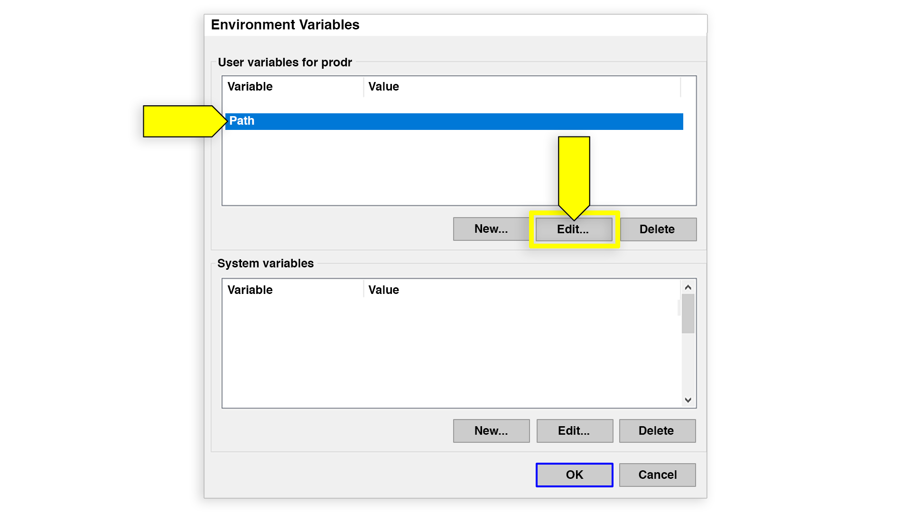

# MySQL Server Installation Guide (Windows)

* Navigate to the MySQL Community Downloads page for the [MySQL Community Server](https://dev.mysql.com/downloads/mysql).

* Select `Microsoft Windows` from the Operating System dropdown menu.

* Click on "Go to Download Page" for `Windows (x86, 32 & 64-bit), MySQL Installer MSI`


* Find the `Windows (x86, 32-bit), MSI Installer` that is the smaller size.


* Click the "Download" button.

* When prompted about signing up for a free Oracle Web Account, click “No thanks, just start my download.”


* Navigate to the folder where the file was downloaded and double-click to run the installer. If you get prompted for an update, proceed with the upgrade.

* On the "Choosing a Setup Type" screen, make sure that "Server Only" is selected, and click on "Next".


* On the "Installation" screen, you'll see your product listed (it should say "MySQL Server", followed by a version number). Click on "Execute".


* Once the installation is complete, click on "Next".

* On the "Product Configuration" screen, click on "Next".

* On the "High Availability" screen, make sure "Standalone MySQL Server / Classic MySEL Replication" is selected and click on "Next". 


* On the "Type and Networking" screen, don’t change anything and click “Next”

* **IMPORTANT**: On the "Authentication Method" screen, make sure to select “Use Legacy Authentication Method (Retain MySQL 5.x Compatibility)" and click “Next”


* On the "Accounts and Roles" screen, create a root password. **WARNING**: Do not forget this password!  It's extremely important that you keep track of your root password for MySQL, as it is difficult to reset. Make sure that you write it down somewhere you can find it or add it to a password manager. 


* After entering a password, click “Next”

* On the "Windows Service" screen, don’t change anything and click “Next”

* Finally, on the "Apply Configuration" screen, click “Execute” to apply the changes.


* After the configuration is complete, click "Finish"

* Now that we have installed MySQL, we need to make sure to add the PATH to the MySQL install to our Environmental Variables.


# PATH setup

* Open any folder on your computer and click on "This PC" in the left-hand navigation bar.


* Next, double-click on your `C:` drive.


* Double-click on the folder named "Program Files", then double-click on the "MySQL" folder. 

  * **Note:** Depending on the version of Windows you have on your computer, MySQL may be inside of the Program Files (x86) folder.

* Double-click on the "MySQL Server 8.0" folder, then double-click on the folder named `bin`. Your screen should look like the following image:


* Right-click the address at the top of the screen and select "Copy address as text"


* Now that you've got the PATH copied to your clipboard, press the Windows key on your keyboard and search for "Edit the system environmental variables". Once that shows up in the search screen, click on it.


* On the System Properties screen, under the "Advanced" tab, click on "Environment Variables"


* On the "Environment Variables" screen, under the section that says "User variables for &lt;user&gt;" (where &lt;user&gt; is your username on that computer), click "Path" and then click on the "Edit..." button.



* On the "Edit environment variable" screen, click on "New…"


* Your cursor will appear in a new line at the bottom of the variables. Paste your PATH in this box and click "OK". 


* Click "OK" on any remaining screens, then restart Git Bash completely. 

* You can verify that the installation was correct by going to Git Bash and typing the following:

  ```bash
  mysql -V
  ```

* The PATH, followed by the MySQL version number, should be printed to the screen.

* Once you verify that the MySQL Server was correctly installed, move onto setting up the MySQL Shell below.


# MySQL Shell

* Now that we have installed the MySQL Server, we need to make sure we can initialize the MySQL command line prompt (or MySQL Shell).

* To open the MySQL shell, click on the "Windows" key and the "R" key at the same time. This will bring up a Run dialog window. Enter "cmd" in the input and click OK. This will open your Windows command prompt.


* Use the `cd` command to navigate to a directory where you'll be working; for example, one of your project folders. 

* Once in the directory, enter the following command to initialize the MySQL command line prompt:

  ```bash
  mysql -u root -p
  ```

* This tells the MySQL shell that you want to log in with the root user (`-u`). The `-p` stands for "password." You will need to enter your MySQL password.


* If you see the MySQL command line prompt `mysql>`, everything is working correctly. 


* Type `quit` to exit the MySQL command line prompt.

**Note:** You can also access the MySQL shell directly in VS Code! Depending on how you set up Git Bash, this may already be available to you. Select Terminal from your menu at the top of the screen and click on New Terminal in the drop-down menu. 


* If a terminal pops up at the bottom of your screen with `cmd`, `powershell`, or `bash` selected, you're good to go. You can click on this drop-down to choose the integrated terminal of your choice.


* If you can't access an integrated terminal and you'd like to, see [the VS Code docs on the integrated terminal](https://code.visualstudio.com/docs/editor/integrated-terminal#_windows).

* Once you verify that the MySQL Shell can be initialized correctly, move onto installing MySQL Workbench below.


# MySQL Workbench Installation Guide

* Navigate to the MySQL Community Downloads page for the [MySQL Workbench](https://dev.mysql.com/downloads/workbench/).

* Select `Microsoft Windows` from the Operating System dropdown menu.

* Scroll down and in "Other Downloads", find `Windows (x86, 64-bit), MSI Installer` and click “Download”.


* When prompted about signing up for a free Oracle Web Account, click “No thanks, just start my download.”

* After the installer has downloaded, open it to begin the installation process.